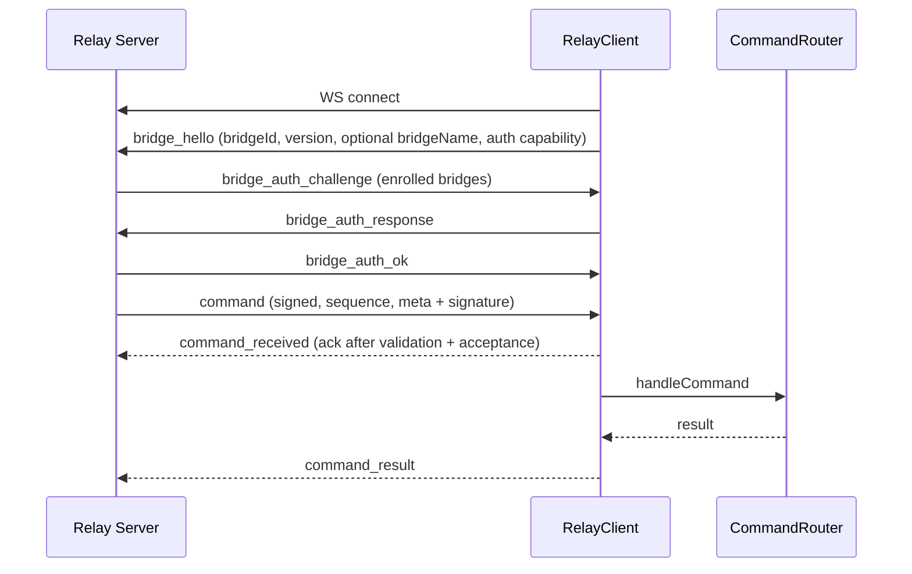

# Integration Flow – Relay (Cloud ↔ Bridge)

## Ziel
Beschreibt den Datenfluss zwischen Cloud‑Relay und Bridge (Commands + Results).

## Ablauf (Mermaid)

```mermaid
sequenceDiagram
  participant Relay as Relay Server
  participant Bridge as RelayClient
  participant Router as CommandRouter

  Bridge->>Relay: WS connect
  Bridge->>Relay: bridge_hello (bridgeId, version, optional bridgeName, auth capability)
  Relay->>Bridge: bridge_auth_challenge (enrolled bridges)
  Bridge->>Relay: bridge_auth_response
  Relay->>Bridge: bridge_auth_ok
  Relay->>Bridge: command (signed, sequence, meta + signature)
  Bridge-->>Relay: command_received (ack after validation + acceptance)
  Bridge->>Router: handleCommand
  Router-->>Bridge: result
  Bridge-->>Relay: command_result
```

## Komponenten
- Bridge: `apps/bridge/src/services/relay-client.ts`
- Router: `apps/bridge/src/services/command-router.ts`

## Reconnect
- Exponentieller Backoff (1s → 60s)
- Resumable Session via `sessionId` + `lastProcessedSequence`
- Pending-Command Replay nur nach Policy und Replay-Limits
- Nach Reconnect/Auth Resync-Trigger (`bridge_resync_required`) + Snapshot-Republish
- Resync-`outputs_snapshot` nutzt den Device-Cache und erzwingt keinen manuellen Refresh.
- Doppelte `requestId`s werden auch waehrend laufender Ausfuehrung dedupliziert.

## Timeout- und Queue-Modell

- WebSocket Heartbeats pruefen nur Transport-Liveness.
- Fachliche Command-SLAs werden ueber die Timeout-Policy bestimmt
  (`apps/bridge/src/services/relay-command-policy.ts`).
- Side-effecting Commands laufen pro Bridge seriell.
- Read-only Commands laufen parallel, aber begrenzt
  (`BRIDGE_RELAY_READ_ONLY_COMMAND_CONCURRENCY`, Default `4`).
- Lokale Bridge-SLA-Ueberschreitungen werden geloggt, nicht pauschal per
  `Promise` abgebrochen.

## Bridge-Events

Die Bridge sendet ueber denselben Relay-WebSocket neben Command-Results auch `bridge_event`-Nachrichten.

Relevante Engine-/Macro-Events:

- `engine_status`: Snapshot-artige Engine-Runtime inklusive `macros`, `macroExecution` und `lastCompletedMacroExecution`.
- `engine_macro_execution`: feingranulare Runtime-Aenderung fuer einen Macro-Lauf.
- `engine_error`: Engine-Fehlerpfad.
- `engine_status_snapshot`: Resync-Snapshot nach `bridge_auth_ok` bzw. Relay-Reconnect.

Die Webapp konsumiert `engine_status` und `engine_macro_execution` als Live-Pfad. Polling bleibt nur Resync-/Fallback-Pfad.

## Sicherheit
- Payloads sind untrusted → Validierung downstream (Zod)
- Commands sind signiert (Ed25519) und enthalten `meta` + `signature`
- Bridge prueft Signatur, TTL und Replay‑Schutz (jti)
- Relay authentisiert enrolled Bridges beim `bridge_hello` per Challenge‑Response (Ed25519)
- Ungepairte Bridges koennen im `pairing-only` Modus verbinden, um `bridge_pair_validate` auszufuehren
- Pairing‑Command validiert Code + Ablaufzeit im Bridge‑Context

## Relevante Dateien
- `apps/bridge/src/services/relay-client.ts`
- `apps/bridge/src/services/command-router.ts`
- `docs/bridge/architecture/relay-enterprise-architecture.md`
