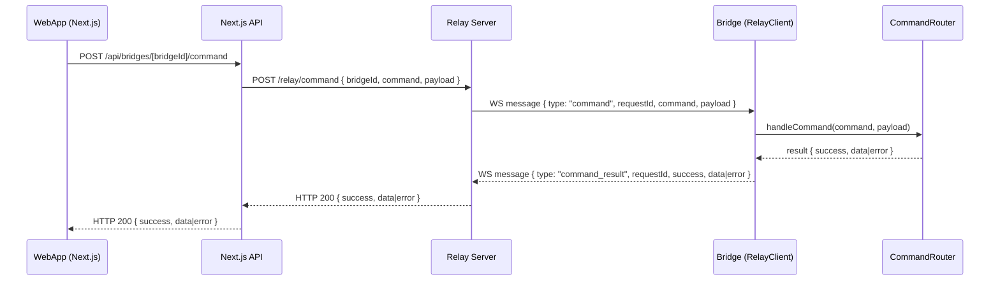
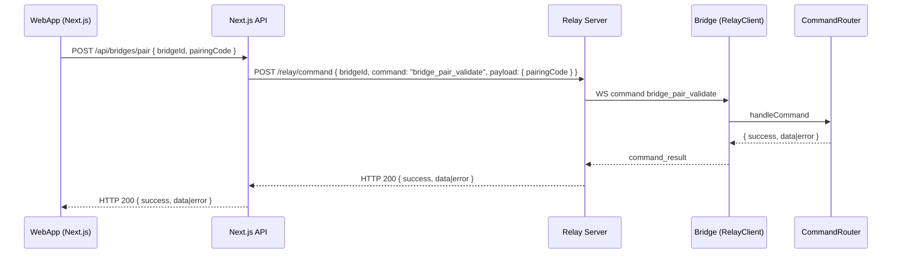

# Relay Data Traffic Documentation (WebApp -> Relay -> Bridge)

## Scope
This document describes the exact data traffic that flows between the WebApp, the Relay server, and the Bridge. It focuses on message formats, commands, payloads, responses, and where the data is processed.

## Sources (code of record)
WebApp (Next.js, repo: broadify):
- broadify/app/api/bridges/[bridgeId]/command/route.ts
- broadify/app/api/bridges/pair/route.ts
- broadify/lib/bridge-commands.ts
- broadify/lib/stores/graphics-store.ts

Relay server (repo: broadify-relay):
- broadify-relay/src/index.ts

Bridge (repo: broadify-bridge-v2):
- apps/bridge/src/services/relay-client.ts
- apps/bridge/src/services/command-router.ts
- apps/bridge/src/services/graphics/graphics-manager.ts
- apps/bridge/src/services/graphics/graphics-schemas.ts
- apps/bridge/src/services/graphics/template-sanitizer.ts
- apps/bridge/src/server.ts

## Components
- WebApp: Next.js app that sends commands to the Relay via API routes.
- Relay server: Fastify HTTP endpoint + WebSocket broker for bridge connections.
- Bridge: Local service that connects outbound to the Relay and executes commands.

## Transport flow (end-to-end)


Pairing flow:


## Message formats
### WebApp -> Next.js API
`POST /api/bridges/[bridgeId]/command`
```json
{ "command": "string", "payload": {} }
```

`POST /api/bridges/pair`
```json
{ "bridgeId": "uuid", "pairingCode": "string", "displayName": "string?" }
```

### Next.js API -> Relay (HTTP)
`POST /relay/command`
```json
{ "bridgeId": "string", "command": "string", "payload": {} }
```

### Relay -> Bridge (WebSocket)
```json
{ "type": "bridge_hello", "bridgeId": "string", "version": "string?" }
```
```json
{ "type": "command", "requestId": "uuid", "command": "string", "payload": {} }
```
```json
{ "type": "command_result", "requestId": "uuid", "success": true, "data": {} }
```
```json
{ "type": "command_result", "requestId": "uuid", "success": false, "error": "string" }
```

## Command catalog (actual WebApp usage)
Source: broadify/lib/bridge-commands.ts

Core:
- get_status -> {}
- list_outputs -> { refresh?: boolean }
- bridge_pair_validate -> { pairingCode: string } (only used via /api/bridges/pair)

Engine:
- engine_connect -> { type: "atem"|"tricaster"|"vmix", ip: string, port: number }
- engine_disconnect -> {}
- engine_get_status -> {}
- engine_get_macros -> {}
- engine_run_macro -> { macroId: number }
- engine_stop_macro -> { macroId: number }

Graphics:
- graphics_configure_outputs -> { outputKey, targets, format }
- graphics_send -> { layerId, category, backgroundMode, layout, zIndex, bundle, values, presetId?, durationMs? }
- graphics_test_pattern -> {}
- graphics_update_values -> { layerId, values }
- graphics_update_layout -> { layerId, layout, zIndex? }
- graphics_remove -> { layerId }
- graphics_remove_preset -> { presetId, clearQueue? }
- graphics_list -> {}

Note: bridge-commands.ts also contains a legacy `configure_outputs` command helper that does not match the Bridge command list. It appears unused in current UI flows.

## Payload details (high-signal)
### graphics_send
The WebApp builds and sends a full rendering bundle:
- bundle.manifest (render config)
- bundle.html (template markup)
- bundle.css (template styles)
- bundle.schema / defaults (data schema)
- bundle.assets (asset metadata)
- values (dynamic content, can contain PII)

This is full content payload and not just metadata.

### engine_connect
The payload includes `ip` and `port` of the target device. This is network-relevant data (can be used for lateral movement if not controlled).

### list_outputs
Returns device and port metadata (names, ids, formats, roles).

## Command processing on the Bridge
Source: apps/bridge/src/services/command-router.ts

- get_status: returns version, runtime state, outputsConfigured, engine state.
- bridge_pair_validate: validates pairing code and expiry. Returns bridgeId/bridgeName on success.
- list_outputs: returns devices/ports from device cache.
- engine_*: connects/disconnects and fetches macro/status data.
- graphics_*: validated and executed by GraphicsManager (Zod schemas + sanitization).

## Data categories and sensitivity
Identifiers:
- bridgeId (UUID)
- orgId (server-side only, WebApp)
- requestId (relay internal)

Secrets:
- pairingCode (short-lived, currently transported to Bridge and sent over Relay during validation)

Content payloads:
- HTML/CSS templates (graphics_send)
- values (dynamic content; can contain PII)

Network data:
- engine_connect ip/port

Device data:
- device ids, display names, port formats and roles

Operational data:
- status, engine macros, outputsConfigured, version

## Logging behavior (data exposure)
Phase-0 Aenderungen:
- WebApp: Voll-Payload-Logging entfernt; optionales Debug-Logging nur als Zusammenfassung
  (gesteuert ueber NEXT_PUBLIC_BRIDGE_DEBUG=true).
- Relay: HTTP-Body- und WS-Payload-Limits je 20 MB; Logs ohne Payloads (nur Message-Typ).
- Bridge: Relay-Payload-Logging entfernt; lokale Endpoints per Token/Loopback geschuetzt.

WebApp:
- bridge-commands.ts loggt nur Zusammenfassungen (keine Payload-Dumps).
- list_outputs Debug-Logging ist optional und auf Summaries reduziert.

Relay:
- Logs enthalten keine Payloads, nur Message-Typen.

Bridge:
- relay-client logs nur Command-Name + RequestId (keine Payload-Dumps).
- /logs endpoint ist lokal oder per Token geschuetzt.

## Validation and sanitization points
- WebApp API: validates only that command is a string; does not validate payload structure.
- Relay: no validation, forwards payload as-is.
- Bridge:
  - Graphics payloads validated by Zod schemas and template sanitization.
  - engine_connect validates type/ip/port in CommandRouter and in engine routes.
  - Other commands have minimal or no payload validation.

## Security observations relevant to data traffic
- Relay transportiert weiterhin volle Payloads und Responses (Content bleibt sensitiv).
- Pairing ist ein separater Command und gate-keine anderen Commands.
- Relay akzeptiert Command/Payload fuer jede verbundene bridgeId (AuthN/AuthZ ist Phase-1).
- Payload-Logging wurde reduziert, dennoch bleibt Content-Exposure im Transportpfad bestehen.


## Payload limits and timeouts
- Bridge HTTP bodyLimit: 20 MB
- Bridge WS maxPayload: 20 MB
- Bridge Relay inbound WS message drop: 20 MB
- Relay HTTP bodyLimit: 20 MB
- Relay WS maxPayload: 20 MB
- Bridge request timeout: 15s
- WebApp error message on size exceed: "Payload zu groß. Maximal 20 MB."
